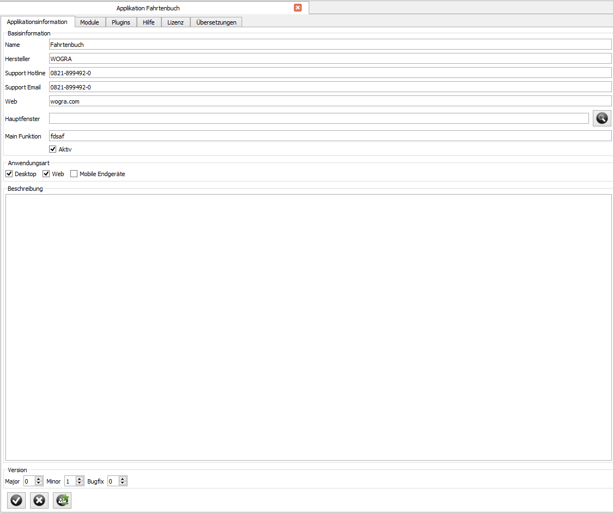

=== Applications

WMS should be used to develop application for different devices like Desktop PC's, Web Application, Mobile Devices and Tablets. If you designed your model, logics and user interfaces you have to configure how the application will be used by the user. You can do this over defining an application.

==== Create an new Application

You can easily create a new application over the “File” menu. Select “New” and click the “New Application” command in the submenu. A new Tab will be opened in the Mainwindow in which you can define your application. Click the “Edit” button and enter the master data for your application. The “Name” ist a required field. All other fields are optional and will be displayed in the “About” box of your application. You can also change the version number of your application. If you want to use your own Mainwindow you can select it over the MainWindow entry. Then you can select a MainWindow you designed for yourself. If you keep the Mainwindow field empty the default MainWindow of WMS will be used to display your configured
modules.

==== Base Data

In the first tab of the application editor you have to enter the base data of the application. The base data are name, vendor, version, description and contact informations which will be displayed in the about box of your application.  Then you can define on which platforms the application should be running. You can choose between Desktop, Web and Mobile/ Tablet Devices. Then you can define your own User Interface for the MainWindow if you don't want the default runtime user interface. This enables you to develop your complete own user interface with WMS beginning at the main window. Over the Main Window you can define all your user interfaces as custom displays. All you need is to select your developped main window. At the moment this works only for desktop and mobile devices. For your own Web interface you have to develop a vaadin mainwindow plugin.

You also are able to call a Main Function before an application window opens. This enables you to do some initialization before the main window will be opened. If your app has no user interface and runs in background this is the method to use to implement your application logic. So you are able to implement non gui background services for diffrent devices. This use full for example for smart factory applications.

There are some rules for the main function. 

1. It must be a public function
2. It must be a static function
3. The function must not have arguments (If you want to get commandline arguments, the wmsFactory has a function for that).
4. You have to enter the full qualified name for the function.

**Example**

Your main function is in a class named Start. The Start class contains to the package "com". The name of your static public function is "main". Then you have to enter following full qualified name:

[source,]
----
com.Start.main
----

This are wrong examples:

[source,]
----
Start.main // does not work because the package is missing and WMS would'nt find the correct class
main // WMS doesn't know in which class the method is.
com.Start.main() // does not work because the braces are not recognized.
com.Start.main(1,"test") // does not work because arguments are forbidden.
----

==== Defining Modules

In WMS every application has different modules which can be used by the user. In the default Mainwindow the modules will be displayed in a own subwindow. If the user selects one module it will be displayed in the central widget and the toolbar will be displayed with the allowed commands of the module. In the menubar you will find a new menu which also displays all allowed actions for the module.

**Note**

If you use your own UI for the mainwindow you can use the module definition but you don't have to. You can call your UI's of your own way and don't need to configure the following datas.

===== Types of Modules

In the modules editor you can select define the type of your module. You can select between data-, form-, or view module. In some cases you have to combine different module types to display the right content in your application.

====== Data Module

In the data module the user can view and edit data of the application. You can show a complete object container or a single
object. You can select the kind of data over the radio buttons (Object or Objectcontainer).

In the field under the radio buttons you have to select the object or object container which should be displayed in this module. First you have to select the class and afterwards to select the Objectcontainer. If you want to display an single object you have to do a third step to select the object.

====== Appearance in the Application

Did you select an object container, the object container will be displayed dependent on his configuration as list or as treeview. The members will be displayed in multiple columns. The possible commands will be displayed in the toolbar and in the menubar.

If you select an object. The objecteditor will be displayed as central widget. The user can edit all members and store his changes over the save command in the toolbar or in the menubar.

====== Form

If you have developed or configured your own form which should be used by the module, you can select it by the from field. In the first step you have to select the type of form and finally you can select your configured form. If you want to use your own form you also have to define on which container or object the form should be used (except it is a form without object or objectcontainer dependency). The form will be displayed in the main window with the selected data if you select
the module in your application.

====== View

A module can also offer a view to data. Before you can add a view module you have to create a new view through the view editor. If you already created a view you can select it over the “Edit” button. After clicking the “Edit” Button a List of all views appears you can select your needed view and click the “OK” Button. Then you have created a view module.

==== Module configuration

After you selected the appearance of the module (Object, Objectcontainer, Form or View) you have to configure some properties
of the module. 

===== Sequence

The display of the modules in the UI can be managed by the module position. You can define the position over the "Move Up" and "Move Down" Buttons below the module list.

===== Default Flag

if check the “Default” checkbox to a module this module will be displayed automatically after starting the application. The default checkbox is only allowed to be checked by one module. In every other module the checkbox must be unchecked. If not, a random behavior will occur.

===== Adding Help Informations

The editor for help texts is a simple WYSISWYG editor in which you can add your help documentation. At the moment there is no paging supported. The text will be saved in HTML format in the database and displayed if the user clicks the help button in the application. You can use internal links for jumping to chapters in the document.

**Note**

If you use your own UI for the mainwindow you can use the help text but you don't have to. You can call your UI's of your own way and don't need to define your help in the application

==== Adding License informations

You can use the license editor to inform your users about the license of the application. The text will be stored in the database as HTML. You can use internal links to enable the user to jump the specific chapters. The license informations will be displayed if the user clicks the license menu entry in the help menu.

**Note**

If you use your own UI for the mainwindow you can use the license information text but you don't have to. You can call your UI's of your own way and don't need to define your license information in the application

==== Translations

In the scheme you can define in which languages the application should be available. Here you can add the translations for each string in each language. To get the strings you have to select all modules in all dialogs. Translations for members and groups will be done in the class editor or member editor. If you added translations the user can select the language in the Mainwindow of the application. After restarting the application the translations will be available.

**Note** 

If you have developed your own Mainwindow you must provide the language selection dialog in your main window. You can use the
  built in language selection dialog but you don't have to.

==== Testing your Application

If you finished the configuration of your application you can test it over the context menu. click the right mouse button on the new application in the “Applications” subwindow (If the new application is missing press the F5 key) and select “Run Application”. The the WMS Runtime will be started without login and without database and application selection and you can test the application.
