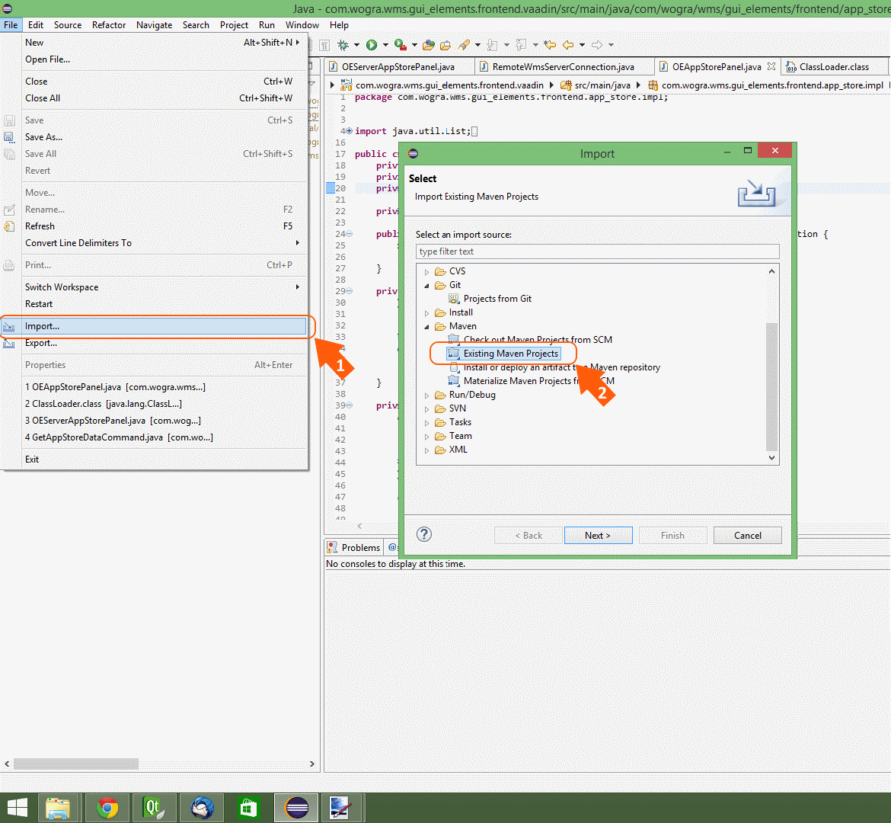
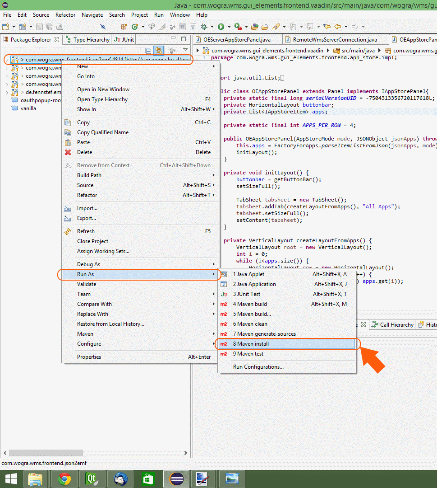
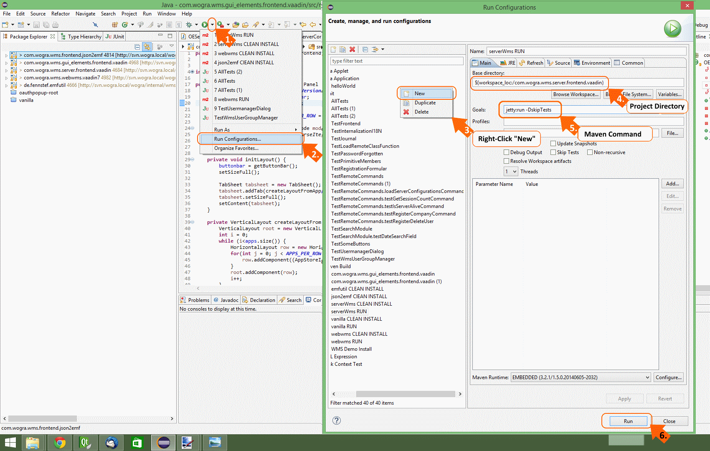
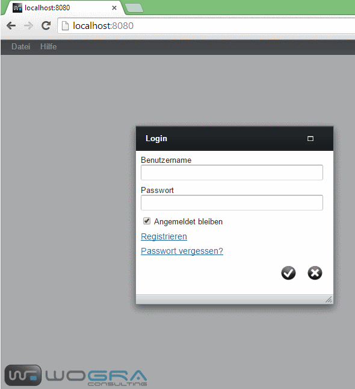

== Installation Guide

=== Windows

1. Download the “full standalone windows package” zip file from the Download Area of wms-project.com.
2. Unzip the file 3.  Run **wmsStartServers.exe** (Ports can be configured in config.properties)
3.  Now you can * Run “Wms Development Platform.exe” (the WMS IDE) or
  * Run “Wms Runtime” (the Start-Application of your Apps) or * Open
“Open WebWms in Browser.exe” (the Web-Application of your Apps) 5.
Login with login = “admin” and password = “admin”

=== Mac OS

Running WMS from Qt Creator:

1.  Open project in Qt Creator
2.  Go to **Projects** > **Build Settings** tab. Deselect **Shadow build** option
3.  Build project
4.  Go to **Projects** > **Run Settings** tab. Set path to wms libraries by adding new a **run environment** variable:
**DYLD_LIBRARY_PATH** = /path/to/bin/mac/release
5.  Copy **dataaccess** folder from /path/to/bin/mac/release to
/path/to/bin/mac/release/wmsapp.app/Contents/MacOS (only has to be
done once)
6.  Run project

Deploying WMS for Mac:

1. Extend Terminal **PATH** variable with path to **macdeployqt** (e.g.. path/to/Qt/5.4/clang_64/bin)
2. Copy all dylibs directly (no subfolders) from path/to/release to /usr/lib
3. It's recommended to do the next steps on a copy of the release folder
4. In Terminal run **macdeployqt wmsapp.app -qmldir=/path/to/wms/wmstools/wmsqml/src** (inside the release folder copy)
    a.  If no error occurs: App should be working
    b.  If error “ERROR: no file at path/to/lib” occurs
        *   Add required libraries to given paths
        *   Create new copy of release folder > repeat step 4.
5.  Qt has copied and linked libraries to wmsapp.app. For further information on mac deployment see http://doc.qt.io/qt-5/osx-deployment.html[Qt OS X deployment documentation].

=== Linux

Unzip the download file and copy the created directory on the place
you want it. change the rights for the executables with chmod 755.

We compiled the files files with SuSE Linux. All dependencies will be
displayed here in the future. If you have trouble with the
executables, download the source code and compile it by yourself.

=== Compiling WMS

Requirements:

* Qt Library 5.7 or higher
* GCC (Linux, Unix)
* MinGW or VisualStudio 2012 or higher (Windows)
* XCode, Clang (MacOS)
* LDAP libraries

==== Compiling with Qt-Creator

With Qt the IDE Qt-Creator will be shipped. With this IDE you can open the project file wms.pro and run compilation (Please make sure that Projects>Build settings: “Shadow build” isn't selected). In Qt-Creator you have to define your output e.g. android, iOS or the platform you are running your Qt. If you want to compile WMS for Windows without VisualStudio. You can download from the Qt page the page with MinGW support. In this package you will find the compiler and nothing else must be installed. For further information visit the Qt website in qt-project.org.

Compiling with QTCreator works on linux (with installed GCC), Windows (with installed MinGW) and MacOS (with installed XCode and Clang).

==== Compiling with commandline on Linux

1.  Unzip the wms.zip file.
2.  Go to the wms directory.
3.  start command qmake -o Makefile wms.pro
4.  start make

WMS will be compiled.

=== Setup Data Access

After Installation you have to configure your dataaccess. In the Dataaccess configuration you configure which datasource you, where the data were saved and how to communicate with it. DataAccess is based on the WMS plugin technology and you are able to implement your own dataaccess. In the standard implementation of WMS we deliver 3 dataaccesse plugins. The SQLite plugin of local development and usage (It stores the data in a sqlite database stored local on your computer). The Relational Database Access for central development and usage (it stores the data in a central relational database such as MySQL, PostgreSQL or Oracle DB). With this plugin your team is able to develop together on the system. The last possibility is using the webclient. It is a http rest request system based on JSON to load and save data over a central server. The server is intended for the use of the WMS Runtimes and has not every function you need for development (e.g. User Management). So it is not recommended to use the server for the WMS Development Platform.

==== SQLite Plugin

After starting the WMS Development Platform the login dialog appears. When the login dialog is open click on the “client settings” button on the left side at the bottom of the login dialog. It opens a new dialog in which you can select the dataaccess plugin you want to use. Select here the "Sqlite" plugin. right to the selection you will find a configure button. click it and you can configure your dataaccess to the sqlite database. Here you can define the place on your hard disk where the sqlite database should be stored. You need read and write access to the directory. If you are doing this to a new
file the database scheme must be created in the file. WMS will check this and after clicking OK the database scheme will be created in the file. If no error occurred you can click the “OK” Button in the client configuration and you can login with the username “admin” and password “admin”.

==== RDB Plugin

After starting the WMS Development Platform the login dialog appears. When the login dialog is open click on the “client settings” button on the left side at the bottom of the login dialog. It opens a new dialog in which you can define the dataaccess plugin you want to use. Add a new DataAccess configuration with the "New" Button. It opens the configuration dialog. Here you can set the name of your configuration and select you plugin. Select here the "Relational Database Access" plugin. Below the selection you can configure your dataaccess to the relational database. Make sure that in the WMS root directory (where the WMS App are) the driver of the database is copied (for mysql or maria db it is libmysql). In the WMS directory you will find the sql script for MySQL or Maria DB to create the database structure. open your db editor and execute it. If you need a sqls cript for other databases please contact us, we can provide you with MSSQL, PostgreSQL and Oracle scripts. After executing the script on DB you can login to WMS with user and password "admin".

==== Webbrowser Rich Client

===== Requirements:

http://www.oracle.com/technetwork/java/javase/downloads/jdk8-downloads-2133151.html[Java JDK 1.8]  

http://www.eclipse.org/downloads/[Eclipse]  

http://eclipse.org/m2e/[Maven Plugin] if not pre-installed with Eclipse  

http://wordpress.wms-project.com/?ddownload=377[Source Code]  

WMS-Server installed and running

After setting up the development environment import the projects in Eclipse with Maven Import.

Afterwards you can run the Maven install command on the projects in the given order.

[source,java]
----
 1. wms.frontend.json2emf         
 2. wms.gui_elements.frontend.vaadin
 3. wms.webwms.vaadin7
 4. wms.server.frontend.vaadin
----

Now you can run the project “wms.webwms.vaadin7” with the Maven Run Command witch execution is similar to Maven install.  If you were confronted with some build failures during the “Run” process, maybe you want to skip the “J-Unit Tests” in your first attempt. For this purpose you have to configure your Maven Run Command, witch is described here:

After both, the Client-Server and the WMS Background-Server, are successfully running, you are able to access the webclient with your favorite Browser on port:8080 with the login Information (username:“admin”, password:”admin”).

=== WMS Server Installation

The WMS Server is a HTTP Rest Server and gives your clients access over the internet or the local network without connecting direct to the database.

include::wms_server.adoc[]

=== Known Issues while installing or running WMS the first time

==== Linux

Know Issues for Linux.

===== Data Access does not work

if you took a binary version of Qt you have to make sure that the database plugins links to the correct installed library for database connection (E.g. libmysql.so.*). If not you have to recompile the Qt plugins, or installing the required version. You will find out which library is missing if you run ldd on your os.

==== Windows

Know Issues for Windows.

===== Data Access does not work

if your relational database data access does not work (e.g. MySQL or PostgreSQL,…) the reason could be that the installed driver was not found. Check which driver is required (with depends tool) and check if it is installed on your machine and if it is the right version (e.g. 32 Bit 64 Bit).

