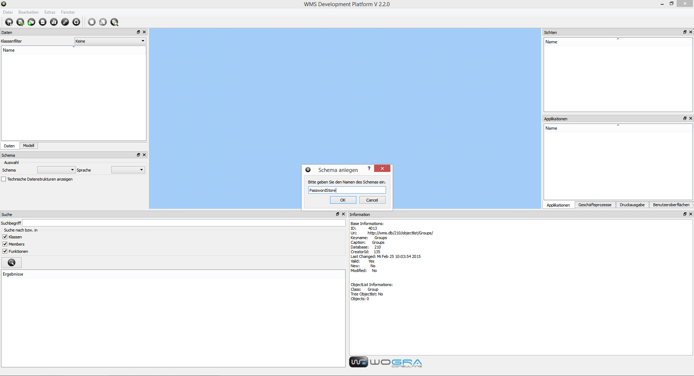
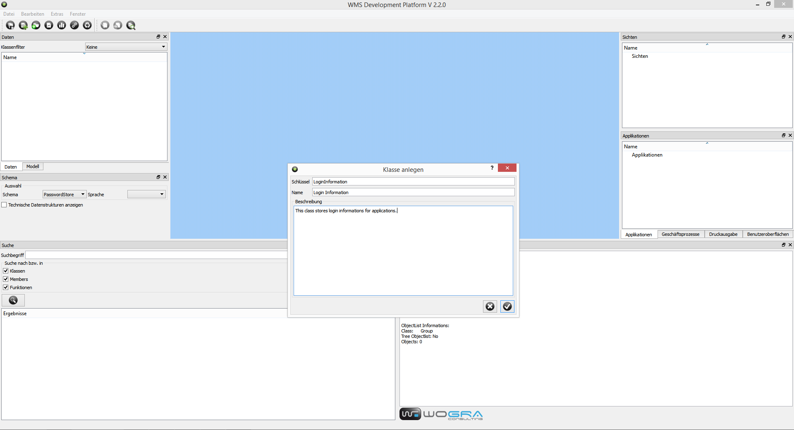
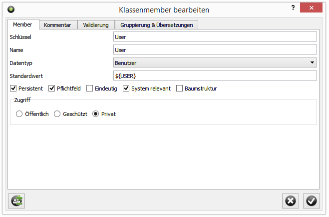
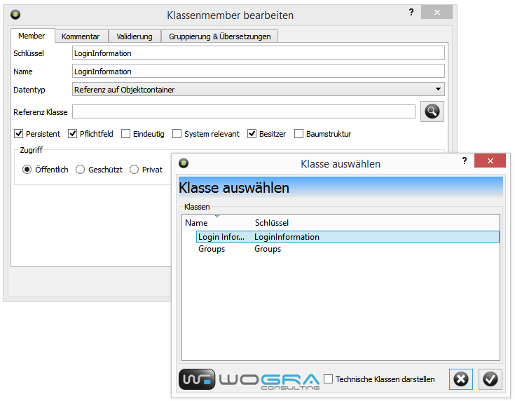
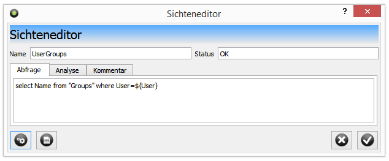
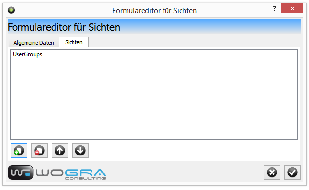
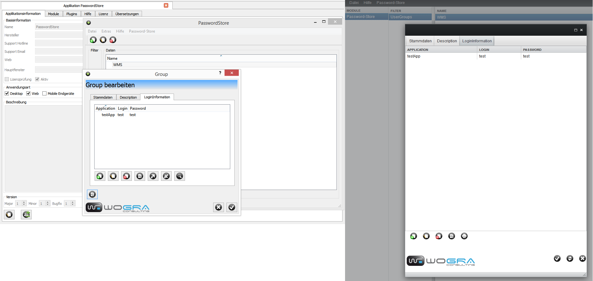

== Sample Application Password Store

You have successfully installed WMS on your system and the database connection works. Now you can start of developing your first application. If you have to install WMS first, you will find further information in the Installation section.

=== Requirements for Tutorial App

So many systems and so many passwords. Especially in the IT you have to remember a large number of passwords. And you have to make sure, that nobody else can access the information. So why don't you implement such a application for storing your passwords with WMS. It is so simple and fast.

First of all we don't want a large list of passwords. we want to group it. I want a group for my passwords at work and for my private passwords. And it could happen that there are further groups that I don't know at the moment.

=== Modeling

So we need two classes one grouping class and one LoginInformation class for storing my passwords, logins.

The group class is simple we only need a name for the group a short description and the list of my login informations. But because it is so easy I want to develop it as multiuser system, so my friends can use this application too. So I have to add the user to the group class which only can see his own data.

The LoginInformation class is not much more complicated. you need a login string, a password string, an application name as string and a text box for additional comments.

This is the complete model. So how to solve this with WMS?

=== Starting WMS Development Platform

First start the WMS Development Platform (WMSDP), login with your credentials and create a new scheme (or use an existing one). If you want to create a new scheme got to the file menu, open the “New” sub menu and click on “New Scheme”. Enter the name “PasswordStore” in the Scheme creator form and click the “OK” button. The scheme will be created. Now select the scheme in the Scheme Subwindow and you see your empty scheme.

=== Creating Classes

The next step is creating your classes in the scheme.

To do this go again in the file menu, open the “New” sub menu and click the “New class” menu item. The class creator form opens. At first we want to create the LoginInformation class. So enter as Keyname “LoginInformation” and as caption “Login Information”. Then add a short description “This class stores login informations for applications.”. Finally click the “OK” button. After this you will find the class in the Model subwindow. select the class in subwindow. The class editors opens in the main window as a new tab. At the moment there is nothing to on the first tab, so we switch to the member tab.

Here we can add our members. We begin with the “Application” member. Click the “New” button under the member list and enter
“Application” as Keyname. Use the same for the Caption. Select the data type String For texts up to 2000 characters. If you want you can define the maximum size but this is not needed. to make sure that the user won't forget to enter the application name check the “Must” checkbox. Set the Accesstype of the member to public, so you can see it in the UI. After you have completed this click the “OK” button.

Repeat this with the member “Login” and “Password”.

At last create a member “Description” of type Character Document (Text). Don't check the “Must” checkbox because enter information here is optionally.

Now we have finished the member definition of our class “LoginInformation”.

To complete the class creation of “LoginInformation” go to first tab click the “Edit” button on the bottom and select “Application” as Caption member. If you have done this, click the “OK” button. This means if you need to select an object of type “LoginInformation” in the selection list will be displayed the name of the Application as identifier.

The next step is to create the class “Group”. Go to the “File” menu open the “New” submenu and click the “New class” menu item. The class creator form appears. Enter as Keyname “Group”. Repeat this for the caption. For the description enter “Grouping of LoginInformation”. and finally click the “OK” Button. The class appears int the “Model” subwindow. Select the class and a second class editor tab opens in the mainwindow.

Now we have to create the members for this class. Got to the “Members” tab and click the “New” Button. We start with the “Name” member. Enter the “Name” as Keyname and Caption, select public data access and String as datatype. The check the “Must” checkbox. Finally click the “OK” button. The member is now visible in the members list.

Continue with the “Description” member but don't check the “Must” checkbox (except you want it to force the user to enter a description) and select “Character Document / Text” as datatype.

The we continue with the “User” member. Over this member we want to make sure that every user only see his/her groups and nothing else. So we have to do a bit more configuration at this member. Enter as Keyname and Caption “User” and select “User” as datatype. Then you have to enter ${USER} in the “Default value” input box. The default value will be filled automatically at creation time of an object. You can add systemvariables as default values. The system variable USER contains the User object you the current logged in user. So the user member will be automatically filled with the user object of the user 
who's created the object. Because every user knows his-/herselves we can change the accesstype to “Private”. This means that this member won't be displayed in UI's and cannot be changed (Except you implement your own UI).

The last member we need is the reference to a container which has our LoginInformations. For this enter as Keyname “LoginInformation” and Caption “Logins”. Select “Objectcontainer reference” as datatype. A new Combobox appears where you can select the class of the container reference. Select the class “LoginInformation”. A group can not exist without a valid LoginContainer reference (In OOP it is called “composition”). To make sure that the system provides the Group object
automatically with a container you have to check the “Owner” checkbox. The “Owner” falg creates automatically a new objectcontainer of type “LoginInformation” if you create a new object of type “Group”. If you delete the group, the container will be deleted, too. To offer the user the possibility to add his/her applications with login data set the dataaccess to “Public”.

Now we created all members for the class. The last step in the class editor is to set the “Caption member” to “Name” in the first tab.

=== Creating Objectcontainer
 
We have finished our modeling task for classes. Now we have to add the possibility for the user to create data. You can do this over the “File” menu. Open the “New” submenu and click the “New objectcontainer” menu item. It opens the objectcontainer creator form. Remember we made sure that LoginInformation containers will be created automatically when a new “Group” object will be created. So we only need to create an objectcontainer for our “Group” objects. Enter “Groups” for Keyname and Caption and select the “Group” class. Finally enter “Groups of LoginInformations” as description and click the “OK” button.

You will find your created container in the Data subwindow. You can click on the container and WMSDP opens the container editor. Now you can already add groups, edit data of the groups and delete them. If you create a new group the generic objecteditors opens and offers you the “Name” input field. The “Description” Textbox with WYSIWYG Editor is on a new tab. The “User” inputfield won't be displayed. On another tab you will find the obejctcontainer editor to create, edit and delete your login informations. So everything you need for storing your logins and passwords for your applications and webpages is here.

=== Creating Views

But we have still a couple of tasks to do before the development is finished. The first task is to make sure, that a user only see's his/her groups. In the objectcontainer all groups were displayed. You can do that with views. Views will be displayed like Objectcontainers but filters the display data with WQL. We can create a new view over the “File” menu in the “New” submenu. Click the “New view” menu item and the view editor opens. Enter the Name “UserGroups” to the editor and add the comment “displays only groups of logged in user.” In the query tab you have to enter the following WQL Query:

----
select Name from "Groups" where User=${USER}
----

With the “Test” button under the WQL Editor you can test if errors occures if you run the WQL command. Please consider that the keynames used in WQL must be case sensitive. If everything was successful click the “OK” button. The view is accessible over the View subwindow in WMSDP. If you select the view in the subwindow the result will appear as a new tab in the main window. The formerly created group object is now visible.

=== Create View Form User Interface

Now we have the right view for displaying our users. if they start the application. Now we have to pack this view in user interface that the end user can access over a runtime. So we have to create one which is based of views. We can create it again over the “File” menu in the submenu “New”. Here you will find a further submenu called “Forms”. Select this submenu and click the “New View form” menu item. The view form editor appears. Enter the name “Groups” in the Name lineedit. You can leave the printing template field empty, because we don't want to offer print output for our application. Uncheck “Allow Journal request”, “Allow Printing”, “Allow Export”, “Allow Import” and “Allow Search”, because we won't offer this functions for our users. On the View Tab we add our created View to the form, over the “New” button.

Now we have configured a simple form which can be displayed in the runtimes of our end users. Of course you have much more possibilities to create UI's, but for our simple case you don't have to.

=== Creating Application

The last step is to create the Application for the user.

In the “File” menu call the “New” submenu and click the “New Application” menu item. The application editor opens and you can enter the data for your application, after you clicked the “Edit” button on the left side under the insensitive edit fields. This starts with the name. Enter “Password Store” and enter data in the following fields. Important is that the “Active” checkbox is checked and that the Application type checkbox for desktop application is checked. Set the version number to 0.0.1 and click the “OK” button. The next step is to create a module that the user can if he/she starts your application. Go to the module tab in the application editor and click the “New” button under the modules list. The Modules editor opens. Enter “Password-Store” as name and select the created user interface over the select button right from the lineedit. A form
appears in which you can select the type of form. We created a view form so you have to select this. Then you will find your created form and you can add it to the module. The “Active” flag must be check. Because we only have one module the position plays no role. Now you can add help texts and license informations to your application if you want. Now you are finished with the Password-Store application. 

To test it open the context menu for the application (right mousebutton click on the application. If the application doesn't
appear in the application window press F5 for refreshing WMSDP) and click the “Execute Application” menu item. It opens the runtime without login form (because you already are logged in) and displays the data in the runtime.

=== Practice Tasks

1.  Change the Password display to encrypted. (Beginner)
2.  Make sure that the application is unique in the container (Beginner):
3.  Add a Infosystem for bank cards or credit cards data to your group. (Beginner)
4.  Create an Import from CSV File to the LoginInformation Object container. (Advanced)
5.  Implement your own user interface for LoginInformation class and group class. (Advanced)
6.  Implement your own MainWindow for the Runtime. (Advanced)
