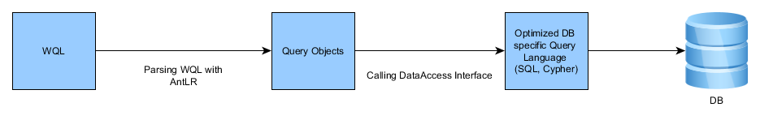

=== WQL

WQL stands for WMS Query Language and is a object oriented query language. WQL is a simple language to filter data from WMS. WQL is very lean compared with select statements in SQL.

==== Limitations

* With WQL you have only readable access to data. There are no possibilities to modify data.
* You can only sort for one member
* You can only querying for members of one class (except reference joins)
* Joins work over references

==== How WQL works

==== Structure

This is the generally structure of WQL Queries:

[source,sql]
----
select <Members Comma seperated> 
from "<ObjectContainer Keyname/ID or Class Keyname + ".class">" 
where <Member conditions> 
group by <Members Comma seperated>
order by <Member> <asc,desc (Default is asc)>
limit <start>,<result quantity>
----

**Example:**

[source,sql]
----
select first_name, last_name from "address" where postcode = 86150 order by last_name asc
----

==== Possible arrangement of queries

===== Selection values

After the “select” keyword it is possible to enter members which you
want to read from database. Independent what memebrs you choose the
obejctid will automatically requested too. Because of this the select
members are optional. The selection values must always be the case
sensitive member keynames.

The member can optionally enclosed by “”“.

**Example:**

[source,sql]
----
select first_name, last_name from ...
----

**Results:**

first_name last_name ObjectId

is a also possible like

[source,sql]
----
select from ...
----

**Results:**

ObjectId

===== Selection value functions (must)

It is possible to use functions for selecting values.

====== Possible functions

- SUM(Member) calculates the sum of the member   
- AVG(Member) calculates the average value of the member  
- MIN(Member) calculates the smallest value of the member  
- MAX(Member) calculates the largest value of the member  

**Example:**

[source,sql]
----
select min(Fee) from…
----
returns the smallest value of member “Fee”.

[source,sql]
----
select min(Fee), max(Price) from…
----

returns the minimum of fee and the maximum of price

===== Joining data

In SQL data of different tables will be concatenated over joins. This
is in object oriented WQL not possible. But you can concatenate data
over obejctreferences. This is much simpler as using joins in SQL. You
can request member of the referenced object if you add the membername
of the referenced object divided with a point. Members can be quoted
by ”“” if spaces are in the member keyname.

<Objectreference>.<Member in Reference>

**Example**

Three classes “Address”, “City” and “Country”.

Class Address

Firstname - String   
Lastname - String   
City - Objektreferenz

Class City

Postcode - String   
City - String   
Country - Object Reference   

Class Country

Name - String   
Sign - String

[source,sql]
----
select Firstname, Lastname, City.Postcode, City.City from AddressContainer  // OK
----

[source,sql]
----
select Firstname, Lastname, City.Postcode, City.City, City.Country.Sign from AddressContainer  // Not possible and wrong
----

====== Handling of Keynames

Keynames for Members or Objectcontainers are Case sensitive. You can
enclose Keynames by “”“ especially if you have special characters used
in the keynames you have to enclose it by ”“” (like “Address_List”).

===== Defining target container or class (must)

After the “from” keyword have to define the objectcontainer on which
the query should take place. Only from this container data can be
selected. You have to take care for lower and uppercase of the
objectcontainer keyname. The container keyname can optionally enclosed
by “”“.

**Example**
[source,sql]
----
select Firstname, Lastname, City.Postcode, City.City from Address

select Firstname, Lastname, City.Postcode, City.City from "Address"
----

Instead of the keyname you are able to select over the containerid. The ContainerId must be enclosed by """.

**Example**
[source,sql]
----
select Firstname, Lastname, City.Postcode, City.City from "7893756"
----

===== Selecting over classes

IN WQL you are able not only to select from a specific objectcontainer but selecting over the class. The result can be found in many different containers of the same class. If you want to select from class instead of objectcontainer you have to add ".class" after the classname in the from clause. You need the full qualified name of the class. This means package structure plus class name (e.g. com.wms.Test.class).

**Example**

Three classes “Address”, “City” and “Country”.

Class Address

Firstname - String   
Lastname - String   
City - Objektreferenz

Class City

Postcode - String   
City - String   
Country - Object Reference   

Class Country

Name - String   
Sign - String

[source,sql]
----
select Firstname, Lastname, City.Postcode, City.City from Address.class
----

returns all results over all containers from Type "Address".

===== Filter conditions (Optional)

With the help of filter conditions you can limit the amount of data
which will be returned. The filter condition can be nested. On the
first level a simple, “AND” or “OR” condition is possible. You can add
as many levels as you need. If the filter condition is missing all
data of the container will be returned.

In opposite to SQL the WMS syntax is different for
filter conditions. There are nine operators you can use. A detailed
description have to write down conditions for datatypes go to the
http://wiki.wms-project.com/doku.php?id=datatypes[datatype
description].

**Operators:**

- Equal ( = )   
- Not equal ( <> )   
- Larger ( > )   
- Smaller ( < )   
- Larger or equal ( >= )   
- Smaller or equal ( ⇐ )   
- In ( in )   
- Not in ( not in )   
- Like (like)

====== Date and Time comparison

If you want to filter for dates or times, you have to use the ISO Format.

**Example:**

Date: YYYY-MM-DD 
Sample: 2012-06-30 for June the 30. 2012 Timestamp:

YYYY-MM-DDTHH:MM:SS 
Sample: 1997-07-16T19:20:30 
for Juli the 16. 1997 at 19:20:30.

====== Nested Conditions

You can create nested conditions and combine “AND” and “OR”
conditions. The syntax is different to SQL and in our point of view
better readable. You start with the “AND” or “OR” operator and add you
condition in braces after the operator.

----
<AND/OR> (<Condition1>, <Condition2>, <Condition3>,...)
----

If you want to nest further condition this works like that:

[source,sql]
----
<AND/OR> (<Condition1>, <Condition2>, <Condition3>, 
          <AND/OR>(<condition1>, <AND/OR>(<condition1>, <condition2>, <condition3>,...), <condition3>,...))
----

**Example:**

[source,sql]
----
select Firstname, Lastname, City.Postcode, City.City 
from "Addresses" 
where AND(Firstname = "George", OR(Lastname = "Jones", Lastname = "Miller"))
----

This nested condition finds all addresses with Firstname “George” and
Lastname “Miller” or “Jones”. String comparison values must be
enclosed by ”“”.

===== Sorting (Optional)

Optional you can sort the result of the query. At the moment you can
only sort for a single member. The member can optionally enclosed by
“”“.

**Syntax:**

order by <Member>

**Limitation:**

The member you select for sorting must a member in the select part, too.

**Examples:**

[source,sql]
----
select Firstname, Lastname, City.Potscode, City.City from Addresses order by Lastname
----

===== Grouping (Optional)
With WQL you are able to group results like in SQL. Every member you want to group must be placed in the select clause, too. 

**Examples:**

[source,sql]
----
select sum(costs), avg(costs), name from costunit group by name
select sum(costs), avg(costs), name, id from costunit group by name, id
----

The result is the sum of the costs and the average of the costs for each name of costunits.

It is also possible to group by references.

**Example:**

[source,sql]
----
select sum(costs), avg(costs), department.name from costunit group by department.name
----

===== Limit (Optional)

With the limit function you are able to realize paging and reducing the resultset to the seize you want. You can add the limit function in two ways. The first way is to define the maximum resultsize you want to have. You can do that with "limit <max result size>". The second way is to define the starting pos and then define the max result size. The synatx for this way is "limit <startpos>,<max result size>".

**Examples:**

[source,sql]
----
select Firstname, Lastname, City.Potscode, City.City from Addresses limit 1
select Firstname, Lastname, City.Potscode, City.City from Addresses limit 1,20
----

===== Selecting values of a specific object. without loading it

If you need only one or some values of a specific object you know and you don't want to load it you can build a query for a specific object. This might be usefull if you have large objects with many members you don't need. To make this happen you can use the "OBJECT_ID" key in the where clause and setting the needed object id.

**Example:**

[source,sql]
----
select firstName, lastName from Address where OBJECT_ID = 4711
----

===== Selecting Enumerations

The member enum must be selected in wql over it's position.

**Example:**

You have an enum sex with two selection values (female, male). If you want to select all males you have to use the position beginning at 0. So female has the value 0 and male has the value 1.

[source,sql]
----
select firstName, lastName from Address where sex = 1 // all males
select firstName, lastName from Address where sex = 0 // all females
----

==== System variables

With system variables you can add values to filter conditions which will be automatically read from the system.

===== USER

The logged in user

===== SESSION

The current session id

===== CURRENTYEAR

the current year.

===== CURRENTMONTH

the current month

===== CURRENTDAYOFMONTH

The current day of month

===== CURRENTDAYOFWEEK

the current day of week.

===== CURRENTWEEKNUMBER

The number of the current week.

===== CURRENTDATE

The current date.

===== CURRENTTIME

the current time.

===== CURRENTTIMESTAMP

the current timestamp.

===== CURRENTLANGUAGE

the current selected language

===== CURRENTDATABASE

The current database id.
